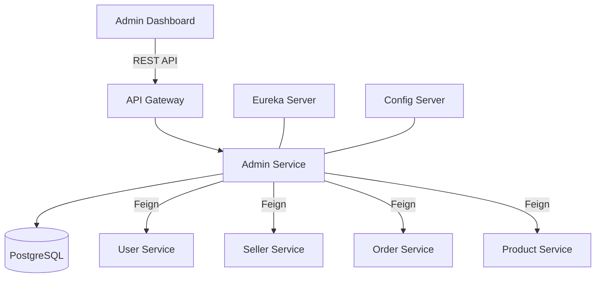

# 🛡️ Admin Service | ShopFlow Microservices

[](https://spring.io/projects/spring-boot)
[](https://www.oracle.com/java/)
[](https://www.postgresql.org/)
[](LICENSE)

The **Admin Service** is the central nervous system for administrative operations within the ShopFlow e-commerce ecosystem. It provides high-level oversight and management capabilities for users, sellers, products, orders, and system-wide auditing.

---

## 🚀 Overview

Designed for high availability and administrative efficiency, this service acts as the orchestration layer for back-office operations. It leverages Spring Cloud for seamless integration with other microservices and provides a robust API for the ShopFlow Admin Dashboard.

### Core Responsibilities:
- **Identity & Access Management:** Comprehensive user and administrator oversight.
- **Marketplace Governance:** Verification and management of sellers and their storefronts.
- **Inventory Oversight:** Product moderation and global catalog management.
- **Order Orchestration:** Monitoring transaction flows and handling complex return/refund requests.
- **Business Intelligence:** Generating system-wide reports and performance metrics.
- **Audit Compliance:** maintaining a strict ledger of all administrative actions.

---

## 🛠️ Technical Stack

- **Framework:** [Spring Boot 3.2.5](https://spring.io/projects/spring-boot)
- **Language:** [Java 21](https://openjdk.org/projects/jdk/21/)
- **Data Persistence:** [PostgreSQL](https://www.postgresql.org/) with [Spring Data JPA](https://spring.io/projects/spring-data-jpa)
- **Migration Engine:** [Flyway](https://flywaydb.org/)
- **Discovery & Config:** [Netflix Eureka](https://github.com/Netflix/eureka) & [Spring Cloud Config](https://spring.io/projects/spring-cloud-config)
- **Communication:** [OpenFeign](https://spring.io/projects/spring-cloud-openfeign) (Declarative REST Clients)
- **Security:** [Spring Security](https://spring.io/projects/spring-security) with JWT/Header-based authentication
- **Mapping:** [MapStruct](https://mapstruct.org/)
- **Utilities:** [Lombok](https://projectlombok.org/)

---

## 🏗️ Architecture

The Admin Service follows a clean architecture pattern, emphasizing separation of concerns and maintainability.



---

## ✨ Key Features & API Modules

### 👤 User Management
- List, filter, and search system users.
- Toggle user account statuses (Enable/Disable).
- View detailed user profiles and activity history.

### 🏪 Seller & Shop Governance
- Review and approve/reject seller registration requests.
- Manage shop visibility and moderation.
- Monitor seller performance metrics.

### 📦 Product Moderation
- Global product search and filtering.
- Review flagged products for compliance.
- Manage categories and global attributes.

### 🧾 Order & Refund Handling
- Real-time order monitoring across the platform.
- Manage complex return workflows and refund approvals.
- Dispute resolution management.

### 📊 Reporting & Analytics
- Aggregate sales data and user growth metrics.
- Generate downloadable CSV/PDF reports.
- System health monitoring.

### 📝 Audit Logging
- Immutable records of every "Write" action performed by administrators.
- Traceability for system configuration changes.

---

## 🚦 Getting Started

### Prerequisites
- JDK 21
- PostgreSQL 15+
- Maven 3.9+
- Running instance of Eureka Server & Config Server

### Configuration
Update `src/main/resources/application.yml` or your central config server with:
```yaml
spring:
  datasource:
    url: jdbc:postgresql://localhost:5432/admin_db
    username: ${DB_USERNAME}
    password: ${DB_PASSWORD}
  jpa:
    hibernate:
      ddl-auto: validate
  cloud:
    config:
      uri: http://localhost:8888
```

### Build & Run
```bash
# Clone the repository
git clone https://github.com/your-org/shopflow-backend.git

# Navigate to service
cd admin-service

# Build the application
./mvnw clean install

# Run the service
./mvnw spring-boot:run
```

---

## 🔒 Security

Administrative endpoints are protected via `HeaderAuthFilter`. It expects validated admin identification typically passed from the API Gateway after JWT verification.

**Endpoint Prefix:** `/api/admin/**`

---

## 📜 License

Distributed under the MIT License. See `LICENSE` for more information.

---

Developed with ❤️ by the ShopFlow Team.
