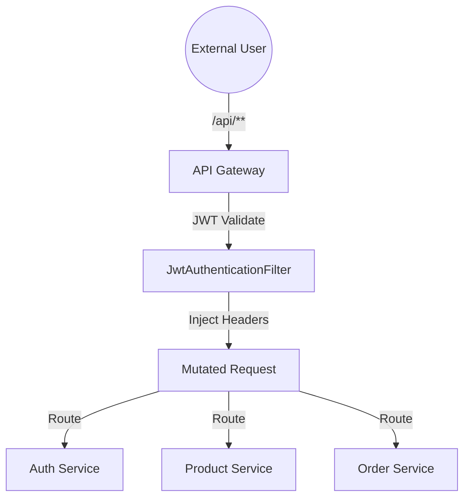

# 🚀 ShopFlow API Gateway

The **API Gateway** is the central entry point and security backbone of the ShopFlow microservices architecture. Built with **Spring Cloud Gateway** and **Spring WebFlux**, it handles all external traffic, enforces security policies, and provides load-balanced routing to downstream services.

---

## 🏗️ Architecture Role

The Gateway acts as a "Single Source of Truth" for authentication and routing:
1. **Dynamic Routing**: Discovers microservice instances automatically via Eureka.
2. **Centralized Security**: Intercepts every request to validate JWT tokens.
3. **Identity Injection**: Standardizes user identity for all internal services.

---

## 🔒 Security Implementation: `JwtAuthenticationFilter`

Our custom `JwtAuthenticationFilter` is a **Global Filter** that runs with the highest precedence.

### 🛡️ Public Access (Whitelist)
Certain endpoints are whitelisted for public access (no token required):
- `POST /api/auth/login`, `register`, `verify-email`
- `GET /api/products/**`, `/api/categories/**`
- `POST /api/payments/webhook/**` (Razorpay/Stripe)

### 🆔 Downstream Identity Injection
When a valid token is provided, the Gateway extracts the user's details and injects them into the request headers for internal use:
- `X-User-Id`: The unique user UUID.
- `X-User-Email`: The user's authenticated email.
- `X-User-Role`: The user's authorization role (ADMIN, SELLER, CUSTOMER).

> [!TIP]
> Downstream microservices can trust these headers blindly because they are stripped of external `X-User-*` headers at the Gateway before injection, ensuring internal security.

---

## 🛠️ Tech Stack

- **Spring Boot 3.4.x** & **Spring Cloud Gateway** (Reactive stack)
- **Eureka Client** for service discovery.
- **JJWT (io.jsonwebtoken)** for stateless authentication.
- **Netty** as the high-performance non-blocking server.

---

## 📡 API Routes

| Endpoint Pattern | Downstream Service | LB ID |
| :--- | :--- | :--- |
| `/api/auth/**` | Authentication & Identity | `auth-service` |
| `/api/users/**` | Profile & Address Mgmt | `user-service` |
| `/api/products/**` | Catalog & Inventory | `product-service` |
| `/api/orders/**` | Cart & Order Processing | `order-service` |
| `/api/sellers/**` | Storefront & Earnings | `seller-service` |
| `/api/admin/**` | Platform Administration | `admin-service` |

---

## 🚦 Configuration

Key properties in `application.yml` or Config Server:
- `spring.cloud.gateway.routes`: Defines target URIs using `lb://` for load balancing.
- `jwt.secret`: Shared secret for token signature verification.
- `globalcors`: Configured to permit requests from the React frontend.
