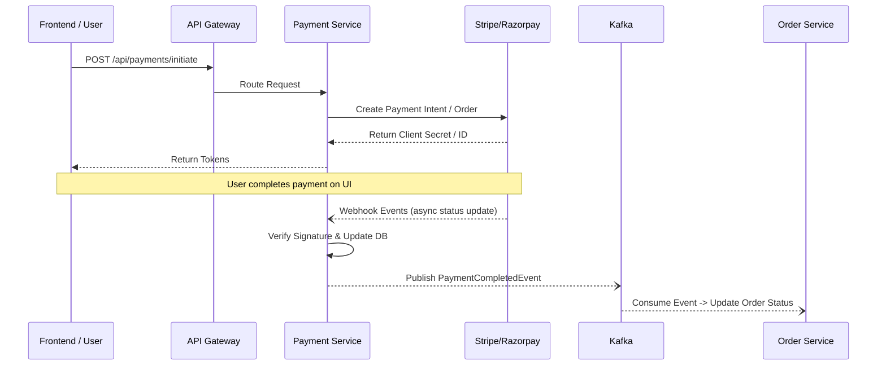

<div align="center">
  <h1>💳 Payment Service</h1>
  <p><i>Reliable, secure, and scalable payment processing for the ShopFlow ecosystem.</i></p>

  [](https://spring.io/projects/spring-boot)
  [](https://java.oracle.com/)
  [](https://www.postgresql.org/)
  [](https://stripe.com/)
  [](https://razorpay.com/)
  [](https://kafka.apache.org/)
</div>

---

## 📖 Overview

The **Payment Service** is a critical microservice within the ShopFlow e-commerce architecture. It serves as the central hub for executing payment transactions, managing refunds, and handling payout calculations. By utilizing well-established payment gateways like **Stripe** and **Razorpay**, it abstracts away the complex logic of external interactions allowing the rest of the ecosystem to perform payment-related activities seamlessly.

This service is fully decoupled, event-driven, and relies on **Apache Kafka** for broadcasting state changes (like `PaymentCompleted`, `PaymentFailed`) across the system, ensuring high-availability and fault tolerance.

## ✨ Core Capabilities

- **Gateway Integration:** Multi-gateway processing logic supporting [Stripe](https://stripe.com/) and [Razorpay](https://razorpay.com/).
- **Webhooks Handling:** Securely captures asynchronous payment status updates straight from payment partners.
- **Refund Management:** Streamlined workflow for partial or full refunds mapped to return requests.
- **Internal APIs:** Highly secure inter-service communication (via OpenFeign) for order verification and seller earnings aggregation.
- **Event-Driven Resilience:** Emits domain events via Kafka so services like `Order Service` or `Notification Service` remain perfectly in sync.

---

## 🏗️ Architecture & Workflow

The basic workflow for a checkout payment process looks like this:



---

## 🛠️ Technology Stack

| Component | Technology | Version / Details |
| :--- | :--- | :--- |
| **Framework** | Spring Boot | `3.2.5` |
| **Language** | Java | `21` |
| **Database** | PostgreSQL | Relational storage for payment tracing |
| **Migrations** | Flyway | Automated database schema versioning |
| **Event Broker** | Apache Kafka | Event streaming and pub/sub |
| **Service Discovery** | Netflix Eureka Client | Dynamic routing integration |
| **API Client** | Spring Cloud OpenFeign| Declarative REST client for inter-service communication |
| **Security** | Spring Security | Protects internal endpoints & decodes tokens |
| **Gateways** | Stripe API, Razorpay API | `25.3.0` & `1.4.5` respectively |

---

## 🚀 API Endpoints Reference

### Public / Client Endpoints
*Requires standard authentication via API Gateway.*

| Method | Endpoint | Description |
| :--- | :--- | :--- |
| `POST` | `/api/payments/initiate` | Generates a payment intent/order via the selected gateway. |
| `POST` | `/api/payments/verify` | Manually verify payment from UI callback. |
| `GET` | `/api/payments/{orderId}` | Fetch payment summary and status for a specific order. |
| `POST` | `/api/payments/{id}/refund` | Initiates a user refund. |
| `GET` | `/api/payments/my` | Retrieve all historical payments for the authenticated user. |

### Webhook Endpoints
*Exposed primarily for external systems. Protected via Cryptographic Signatures.*

| Method | Endpoint | Description |
| :--- | :--- | :--- |
| `POST` | `/api/payments/webhook/razorpay` | Asynchronous updates from Razorpay (`X-Razorpay-Signature`). |
| `POST` | `/api/payments/webhook/stripe` | Asynchronous updates from Stripe (`Stripe-Signature`). |

### Internal Endpoints
*Only accessible within the private cluster network. Used by other microservices.*

| Method | Endpoint | Description |
| :--- | :--- | :--- |
| `GET` | `/api/payments/internal/earnings/{sellerId}` | Aggregates earnings for a specific seller. |
| `POST` | `/api/payments/internal/{paymentId}/refund` | Trigger refund based on internal return workflows. |
| `GET` | `/api/payments/internal/revenue` | System-wide revenue reporting (admin reporting). |
| `GET` | `/api/payments/internal/order/{orderId}` | Fetches mapped payment details for an order. |

---

## ⚙️ Configuration & Setup

### Prerequisites
- JDK 21+
- PostgreSQL
- Apache Kafka instance 
- Config Server must be running (the service gets its config from `shopflow-backend/config-server`).

### Environment Variables
For secure local development, ensure these variables are supplied to your run configuration or OS environment:

```properties
# Razorpay Configuration
RAZORPAY_KEY_ID=your_razorpay_key_id
RAZORPAY_KEY_SECRET=your_razorpay_key_secret
RAZORPAY_WEBHOOK_SECRET=your_razorpay_webhook_secret

# Stripe Configuration
STRIPE_API_KEY=your_stripe_secret_key
STRIPE_WEBHOOK_SECRET=your_stripe_webhook_secret

# Database & Broker overrides
SPRING_DATASOURCE_URL=jdbc:postgresql://localhost:5432/shopflow_payment
SPRING_KAFKA_BOOTSTRAP_SERVERS=localhost:9092
```

### Running the Service

1. **Build the application**:
   ```bash
   ./mvnw clean package -DskipTests
   ```
2. **Start the service**:
   ```bash
   java -jar target/payment-service-0.0.1-SNAPSHOT.jar
   ```

*Ensure Eureka Server & API Gateway are running to test full interactions!*

---

> **Note to Developers:** When adding a new payment gateway provider, implement the generic `PaymentGatewayStrategy` module and register your webhook controller safely under `/webhook/{provider}` respecting signature validation logic.
