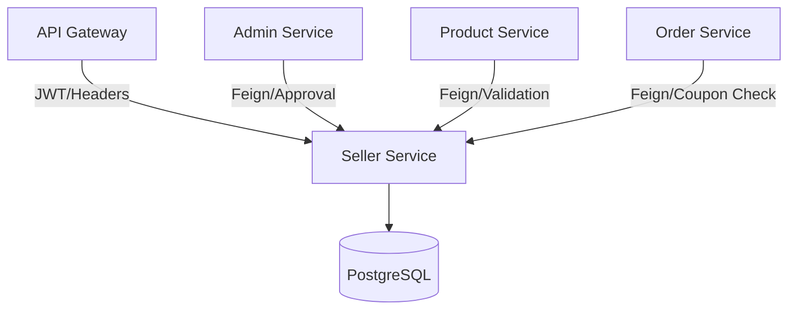

# 🏪 ShopFlow Seller Service

[](https://openjdk.org/projects/jdk/21/)
[](https://spring.io/projects/spring-boot)
[](https://www.postgresql.org/)
[](https://spring.io/projects/spring-cloud)

The **Seller Service** is the backbone of the ShopFlow marketplace, managing the complete lifecycle of sellers. From onboarding and verification to store management and administrative controls, this service ensures a secure and scalable environment for merchants to thrive.

---

## 🚀 Key Features

- **Merchant Onboardng**: Comprehensive registration flow with GST verification and workflow-driven status management (`PENDING`, `APPROVED`, `REJECTED`).
- **Store Management**: Dynamic profile management allowing sellers to update store identity and descriptions.
- **Earnings Dashboard**: Centralized tracking of seller revenue and financial performance.
- **Advanced Coupon Engine**: 
    - Support for multiple discount types: `PERCENTAGE` and `FIXED`.
    - Lifecycle management: creation, retrieval, and deletion.
    - Real-time validation logic against order totals.
- **Admin Governance**: 
    - Streamlined approval workflows for new sellers.
    - Dynamic commission rate management per seller.
- **Inter-service Integrity**: Provides critical validation endpoints for `Product Service` (to verify seller status) and `Order Service` (to validate coupon applicability).

---

## 🛠️ Tech Stack

- **Core Infrastructure**: 
    - **Language**: Java 21
    - **Framework**: Spring Boot 3.2.5
    - **Database**: PostgreSQL (Relational persistence)
    - **Migration**: Flyway (Versioned schema evolution)
- **Microservice Patterns**:
    - **Feign Client**: Declarative REST client for service-to-service communication.
    - **Eureka**: Automated Service discovery.
    - **Config Server**: Externalized and centralized configuration.
- **Security & Validation**:
    - **Spring Security**: JWT-aware security context populated via Gateway headers.
    - **Bean Validation**: Strict JSR-303 data integrity checks.
- **Developer Productivity**: 
    - **Lombok**: Reduced boilerplate.
    - **Spring Boot DevTools**: Hot reloading.

---

## 🏗️ Architecture & Interaction

The Seller Service operates as a critical validator within the microservices mesh. It ensures that only verified sellers can list products and only valid coupons are applied at checkout.



### Seller Lifecycle Lifecycle
1.  **Registration**: User submits registration data; status set to `PENDING`.
2.  **Verification**: Admin reviews GST/business details via the Admin Service.
3.  **Activation**: Upon approval, the seller can begin listing products and creating coupons.

---

## 📡 API Endpoints

### 🏪 Merchant Operations
| Method | Endpoint | Description |
| :--- | :--- | :--- |
| `POST` | `/api/sellers/register` | Register as a new seller (GST required) |
| `GET` | `/api/sellers/me` | Retrieve professional profile and status |
| `PUT` | `/api/sellers/me/store` | Update store name and description |
| `GET` | `/api/sellers/me/earnings` | Fetch total earnings summary |

### 🎟️ Coupon Management
| Method | Endpoint | Description |
| :--- | :--- | :--- |
| `GET` | `/api/sellers/me/coupons` | List all coupons managed by the seller |
| `POST` | `/api/sellers/me/coupons` | Create a new discount voucher |
| `DELETE` | `/api/sellers/me/coupons/{id}` | Permanently remove a coupon |

### 🔒 Internal (Service-to-Service)
*Secured endpoints intended for internal microservice consumption.*

| Method | Endpoint | Consumer | Description |
| :--- | :--- | :--- | :--- |
| `GET` | `/api/sellers/internal/{id}` | Product Service | Validate seller identity & status |
| `GET` | `/api/sellers/internal/coupons/validate` | Order Service | Validate coupon code and order total |
| `PUT` | `/api/sellers/internal/{id}/approve` | Admin Service | Grant selling privileges |
| `PUT` | `/api/sellers/internal/{id}/commission` | Admin Service | Update merchant commission rate |

---

## ⚙️ Configuration & Setup

### Requirements
- **JDK 21**
- **Maven 3.x**
- **PostgreSQL 14+**
- **ShopFlow Config Server** (Running on port 8888)

### Running Locally
```bash
# Clone the repository
git clone <repository-url>

# Navigate to service directory
cd seller-service

# Run the application
mvn spring-boot:run
```

### Security Configuration
The service is designed to run behind the **ShopFlow API Gateway**. It relies on `X-User-Id` and `X-User-Role` headers injected by the gateway after successful JWT verification. Local testing requires these headers for authenticated paths.

---

## 📄 License
Part of the **ShopFlow Microservices** ecosystem. Proprietary and confidential.
