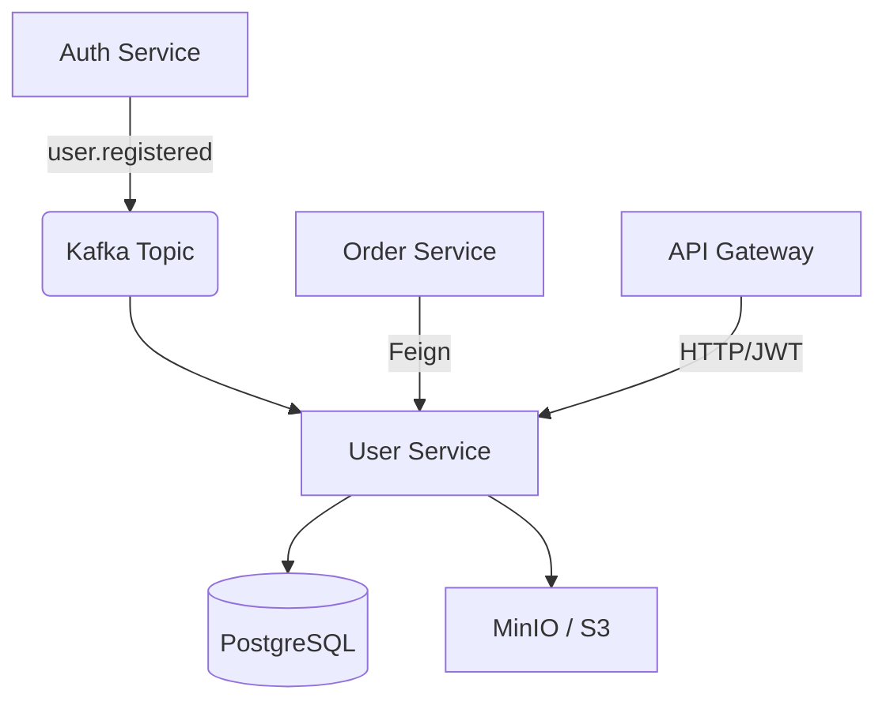

# 👤 ShopFlow User Service

[](https://openjdk.org/projects/jdk/21/)
[](https://spring.io/projects/spring-boot)
[](https://www.postgresql.org/)
[](https://kafka.apache.org/)

The **User Service** is a critical component of the ShopFlow microservices ecosystem. It serves as the single source of truth for user profile data, address books, and identity-related preferences. Built with a focus on high availability, consistency, and event-driven integration.

---

## 🚀 Key Features

- **Profile Management**: Robust handling of user personal information, contact details, and preferences.
- **Address Book**: Multi-address management system with support for "Default" shipping/billing tags.
- **Avatar Subsystem**: Seamless integration with S3-compatible storage (MinIO) for high-performance avatar uploads and processing.
- **Event-Driven Initialization**: Automatically bootstraps user profiles upon receiving registration events via Kafka.
- **Geo-Data Support**: Structured address storage optimized for checkout logic in the Order Service.
- **Internal Feign APIs**: High-speed internal endpoints for inter-service communication (e.g., fetching shipping details for orders).

---

## 🛠️ Tech Stack

- **Framework**: Spring Boot 3.2.5
- **Language**: Java 21 (Virtual Threads ready)
- **Data Persistence**: Spring Data JPA + PostgreSQL
- **Migrations**: Flyway (Version-controlled schema changes)
- **Messaging**: Spring Kafka (Event-driven integration)
- **Object Mapping**: MapStruct (High-performance type-safe mapping)
- **Cloud Native**:
    - **Eureka Client**: Service Discovery
    - **Spring Cloud Config**: Centralized configuration management
- **Storage**: AWS S3 SDK (Optimized for MinIO)
- **Utility**: Lombok

---

## 🏗️ Architecture & Data Flow

Detailed overview of how the User Service interacts within the ecosystem:



### Event Flow: Initial Onboarding
1.  **Auth Service** publishes a `UserRegisteredEvent` to the `user.registered` topic.
2.  **User Service** consumes the event and executes `userService.createInitialProfile()`.
3.  Initial profile metadata is persisted, and the system is ready for the user to add addresses/avatars.

---

## 📡 API Endpoints

### 👤 Profile Management
| Method | Endpoint | Description |
| :--- | :--- | :--- |
| `GET` | `/api/users/profile` | Retrieve the authenticated user's profile |
| `PUT` | `/api/users/profile` | Update profile information (Name, Phone, etc.) |
| `POST` | `/api/users/avatar` | Upload/Update user avatar (Multipart/Form-Data) |

### 📍 Address Management
| Method | Endpoint | Description |
| :--- | :--- | :--- |
| `GET` | `/api/users/addresses` | Fetch all saved addresses |
| `POST` | `/api/users/addresses` | Add a new address to the book |
| `PUT` | `/api/users/addresses/{id}` | Modify an existing address |
| `DELETE` | `/api/users/addresses/{id}` | Remove an address |
| `PUT` | `/api/users/addresses/{id}/default` | Set a specific address as the default |

### 🔒 Internal (Service-to-Service)
*These endpoints are designed for internal consumption via Feign Clients and are typically secured at the Gateway level.*

| Method | Endpoint | Consumer | Description |
| :--- | :--- | :--- | :--- |
| `GET` | `/api/users/internal/{userId}` | Order Service | Fetch default shipping address |
| `GET` | `/api/users/internal/profile/{userId}` | Order/Review Service | Fetch user identity metadata |

---

## ⚙️ Configuration & Setup

### Environment Requirements
- **JDK 21**
- **Maven 3.x**
- **PostgreSQL Instance**
- **Kafka Cluster**
- **S3 / MinIO Credentials**

### Key Properties
| Property | Description | Default |
| :--- | :--- | :--- |
| `spring.application.name` | Service identifier | `user-service` |
| `server.port` | HTTP Port | `8082` |
| `spring.config.import` | Config Server URI | `http://localhost:8888` |
| `spring.kafka.bootstrap-servers` | Kafka connectivity | `localhost:9092` |

---

## 🧪 Development & Testing

### Running Locally
```bash
mvn spring-boot:run
```

### Database Migrations
Flyway is used for schema management. Migrations are located in:
`src/main/resources/db/migration`

### Security Note
This service expects a valid JWT to be validated at the **API Gateway**. It retrieves the `userId` from the `X-User-Id` header (via Security Context), ensuring strict isolation between user data.

---

## 📄 License
Part of the **ShopFlow Microservices** project. All rights reserved.
